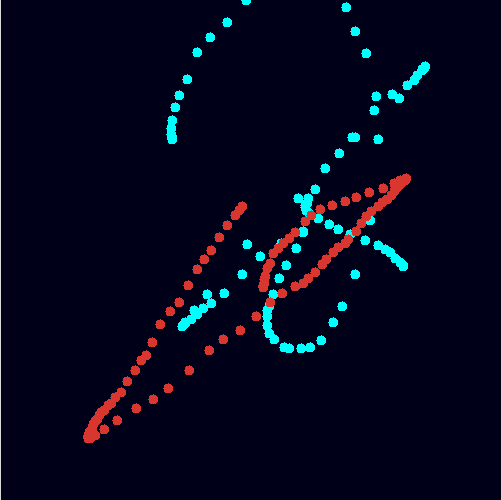
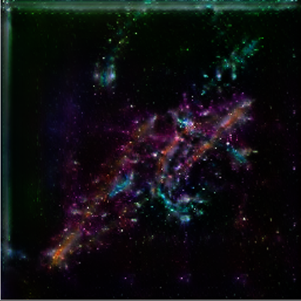
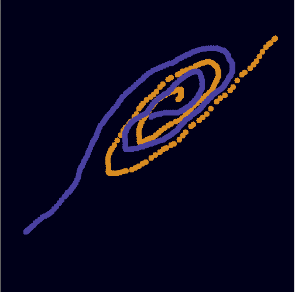
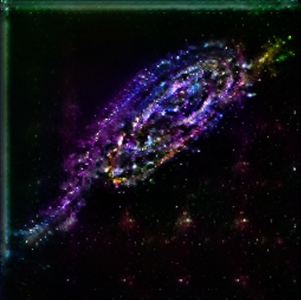
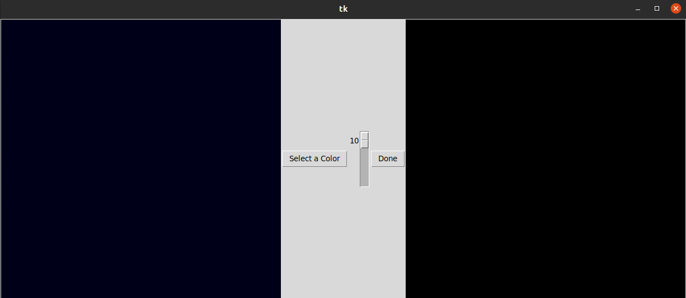
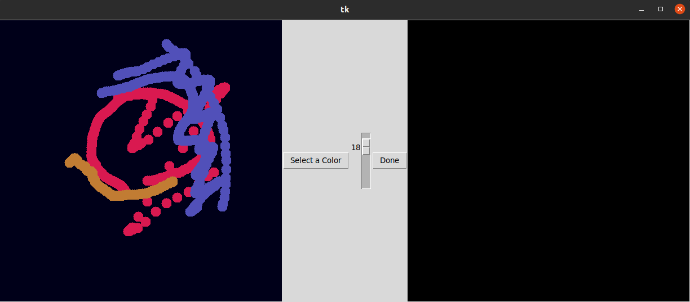
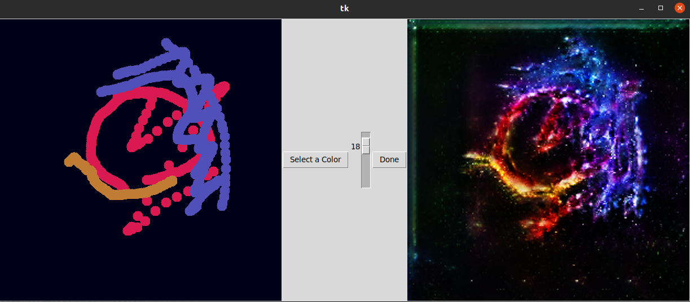

# SpaceGAN:

$
f(x) = \underset{C}{\operatorname{argmax}} P(C_{i} | x) \\\:\\
= \underset{C}{\operatorname{argmax}} \{P(Cooks | x), P(Orders | x)\} \\\:\\
$

**SpaceGAN** is a deep learning model that generates space images based on a sketch. It is inspired from the paper: **Semantic Image Synthesis with Spatially-Adaptive Normalization**  [\[arxiv\]](https://arxiv.org/abs/1903.07291)

---

# Examples:

| Sketch | Generated image |
|--|--|
| ||

| Sketch | Generated image |
|--|--|
| ||

---

# Demo:

 1. Start by cloning the this repository: \
 `git clone https://github.com/TheSun00000/spacegan`
 2. Download the generator model `generator230.pt` from [here](https://drive.google.com/drive/folders/1F7ckeHJWnMe0hEaY2U2w1aTtCWHg9r5N?usp=sharing).
 3. Put the downloaded model in the inference folder.
 4. Run `inference/main.py`: \
 `python inference/main.py`
 5. You would be able to see a small graphical interface like this:\

 6. Select a color, select a pen size, and start sketching your galaxies: \
 
 7. Once finished, click on the button "Done": \
 

